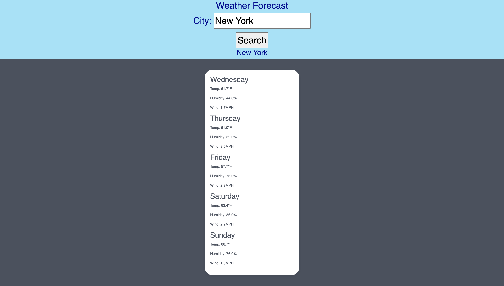

# Weather Forecast

## Description

As a traveler I wanted to have an efficient and handy tool that allowed me to know the weather of any city for the next five days. I frequently travel and often find myself in need of detailed, city-specific weather information. I found existing solutions to be bloated with features I didn't need, so I decided to create my own.

## Table of Contents 

- [Usage](#usage)
- [Credits](#credits)
- [License](#license)

## Usage

1. The Weather Dashboard is very straightforward and user-friendly.

2. Open the webpage. You'll see the main heading "Weather Forecast" at the top of the page. Below that, there's an input field next to the label "City:" and a "Search" button.

3. Enter the name of the city you want to check the weather for in the input field. 

4. Click the "Search" button.
The webpage will then fetch the weather data for the city you entered and display the 5-day forecast below. For each day, it will show the temperature, humidity, and wind speed.

5. To check the weather for another city, simply repeat steps 2-3.

6. Search History is saved under local storage. 

## Credits

Weather API: https://openweathermap.org/api
Shawn Littrel: Teacher Aid
Ruben Ruiz: Bootcamp colleague 
W3shools: https://www.w3schools.com/js/js_date_methods.asp
W3Schools: https://www.w3schools.com/js/js_loop_for.asp
MDN: https://developer.mozilla.org/en-US/docs/Web/API/Window/localStorage
MDB Bootstrap: https://mdbootstrap.com/docs/standard/extended/weather/

## License

MIT License

Copyright (c) [2023] [HectorDelgado]

Permission is hereby granted, free of charge, to any person obtaining a copy of this software and associated documentation files (the "Software"), to deal in the Software without restriction, including without limitation the rights to use, copy, modify, merge, publish, distribute, sublicense, and/or sell copies of the Software, and to permit persons to whom the Software is furnished to do so, subject to the following conditions:

The above copyright notice and this permission notice shall be included in all copies or substantial portions of the Software.

THE SOFTWARE IS PROVIDED "AS IS", WITHOUT WARRANTY OF ANY KIND, EXPRESS OR IMPLIED, INCLUDING BUT NOT LIMITED TO THE WARRANTIES OF MERCHANTABILITY, FITNESS FOR A PARTICULAR PURPOSE AND NONINFRINGEMENT. IN NO EVENT SHALL THE AUTHORS OR COPYRIGHT HOLDERS BE LIABLE FOR ANY CLAIM, DAMAGES OR OTHER LIABILITY, WHETHER IN AN ACTION OF CONTRACT, TORT OR OTHERWISE, ARISING FROM, OUT OF OR IN CONNECTION WITH THE SOFTWARE OR THE USE OR OTHER DEALINGS IN THE SOFTWARE.